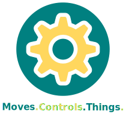

<h1 align="center">Machinekit-HAL</h1>

<div align="center"></div>

<h4 align="center">Universal <i>framework</i> for machine control.</h4>

<p align="center">
<a href="https://github.com/machinekit/machinekit-hal/actions" target="_blank">

</a>

<a href="https://github.com/machinekit/machinekit-hal/actions" target="_blank">

</a>

<a href="https://app.circleci.com/pipelines/github/machinekit/machinekit-hal" target="_blank">

</a>

<a href="https://cloud.drone.io/machinekit/machinekit-hal" target="_blank">

</a>

<a href="https://scan.coverity.com/projects/machinekit-machinekit-hal">

</a>


<a href="https://matrix.to/#/#machinekit:matrix.org" target="_blank">

</a>

<a href="https://groups.google.com/forum/#!forum/machinekit" target="_blank">

</a>

<a href="http://www.machinekit.io/community/c4/" target="_blank">

</a>

</br>

<a href="https://cloudsmith.io/~machinekit/repos/machinekit-hal/packages/" target="_blank">

</a>

<a href="https://cloudsmith.io/~machinekit/repos/machinekit/packages/" target="_blank">

</a>
</p>

<p align="center">
<a href="https://machinekit.io/">Website</a>
|
<a href="https://machinekit.io/docs">Docs</a>
|
<a href="http://www.machinekit.io/about">About</a>
</p>

**Machinekit-HAL** is a powerful software for _real-time_ control of machinery based on _**H**ardware **A**bstraction **L**ayer_ principle. With tools and libraries making development of new _components_ and _drivers_ easy. Integrators can choose to control **industrial robotic arm**, **single purpose machine** or **CNC mill** or **lathe** with additional software package.

Supporting _RT PREEMPT_ and _Xenomai 2_ real-time Linux kernel patches. **APT** packages available for Debian 11 _Bullseye_, Ubuntu 18.04 _Bionic_ LTS, Ubuntu 20.04 _Focal_ LTS and Ubuntu 21.04 Hirsute.

<div align="center"></div>

## Getting started

The easiest way how to get **Machinekit-HAL** running is to install Debian package. Packages can be obtained by triggering Github Actions _workflow_ and downloading **build artifacts** on your own _fork_. Packages build from every push to [master branch](https://github.com/machinekit/machinekit-hal/actions?query=branch:master) on official [Machinekit/Machinekit-HAL repository](https://github.com/machinekit/machinekit-hal) are also distributed through [Machinekit-HAL](https://cloudsmith.io/~machinekit/repos/machinekit-hal/packages/) repository ([Dependencies](https://cloudsmith.io/~machinekit/repos/machinekit/packages/)) kindly hosted by [Cloudsmith](https://cloudsmith.io).

Available packages constituting the Machinekit-HAL are:

* **libmachinekit-hal**: Main shared libraries needed for the core functionality

* **libmachinekit-hal-dev**: Development files (headers, CMake export scripts and `STATIC` libraries) for the `libmachinekit-hal` package

* **modmachinekit-hal-components**: Managed modules (components) for dynamic loading into HAL

* **modmachinekit-hal-drivers**: Managed modules (drivers) for dynamic loading into HAL

* **modmachinekit-hal-drivers-dev**: Development files (headers, CMake export scripts and `STATIC` libraries) for the `modmachinekit-hal-drivers` package

* **machinekit-hal-unmanaged-components**: Unmanaged modules (components) for dynamic loading into HAL

* **machinekit-hal-unmanaged-drivers**: Unmanaged modules (drivers) for dynamic loading into HAL

* **machinekit-hal-testsuite-runtests**: Machinekit-HAL `runtest` suite of tests

* **machinekit-hal**: Main executables of the Machinekit-HAL project

* **python3-machinekit-hal**: Python3 specific executables of the Machinekit-HAL project

* **python3-libmachinekit-hal**: Python3 specific modules and packages of the Machinekit-HAL project

* **python3-modmachinekit-hal-unmanaged-components**: Machinekit-HAL unmanaged modules (components) implemented in a Python3

* **python3-modmachinekit-hal-unmanaged-drivers**: Machinekit-HAL unmanaged modules (drivers) implemented in a Python3

To access the Cloudsmith repositories you will need to add it to your
keyring and sources.list:

```sh
curl -1sLf 'https://dl.cloudsmith.io/public/machinekit/machinekit-hal/cfg/gpg/gpg.D35981AB4276AC36.key' | sudo apt-key --keyring /etc/apt/trusted.gpg.d/cloudsmith-apt-key.gpg add

touch /etc/apt/sources.list.d/machinekit.list

sudo sh -c "echo 'deb https://dl.cloudsmith.io/public/machinekit/machinekit-hal/deb/debian bullseye main' >> /etc/apt/sources.list.d/machinekit.list"

sudo sh -c "echo 'deb-src https://dl.cloudsmith.io/public/machinekit/machinekit-hal/deb/debian bullseye main' >> /etc/apt/sources.list.d/machinekit.list"
```

In most cases, all packages will be installed (with maybe the exception of `machinekit-hal-testsuite-runtests`).

```sh
sudo apt install -y libmachinekit-hal libmachinekit-hal-dev modmachinekit-hal-components modmachinekit-hal-drivers modmachinekit-hal-drivers-dev machinekit-hal-unmanaged-components machinekit-hal-unmanaged-drivers machinekit-hal-testsuite-runtests machinekit-hal python3-machinekit-hal python3-libmachinekit-hal python3-modmachinekit-hal-unmanaged-components python3-modmachinekit-hal-unmanaged-drivers
```

## Dependencies and Tools
You can use a standard **Debian** tools to download and install most of the dependencies (with the exception of build tools):

```sh
git clone https://github.com/machinekit/machinekit-hal.git
cd machinekit-hal
debian/bootstrap
mk-build-deps -irs sudo
```

To get a functioning filesystem capable of building Machinekit-HAL, consult the `machinekit-builder` Docker images. You can build them via the `debian/buildcontainerimage.py` script from `Dockerfile` in the `debian/buildsystem` directory.

If you have trouble, please try installing the dependancies by hand:
```sh
sudo apt install python3-build cython3 libczmq-dev python3-avahi \
  avahi-daemon avahi-discover avahi-utils libnss-mdns mdns-scan git \
  gcc g++ python pkg-config libssl-dev libdbus-1-dev \
  libglib2.0-dev libavahi-client-dev ninja-build python3-venv python3-dev \
  python3-pip unzip libgirepository1.0-dev libcairo2-dev \
  libjansson-dev libgtk2.0-dev python3-protobuf libprotobuf-dev \
  libck-dev libcgroup-dev libcmocka-dev yapps2 libreadline-dev \
  libmodbus-dev libusb-dev libusb-1.0-0-dev nanopb libboost-dev \
  libck-dev libcgroup-dev libcmocka-dev yapps2 libreadline-dev \
  libwebsockets-dev
```

## Building from Source:

Machinekit-HAL uses a **CMake** based buildsystem and supports generation and usage of both *makefiles* and *ninjafiles* for **GNU make** and **Ninja Multi-Config** centered workflows.

Building requires a Linux installation with build tools installed (functioning C and C++ compiler, linker, pkg-config, sysroot etc) and the latest stable CMake executables as specified on [download page](https://cmake.org/download/). (Main target for Machinekit-HAL are Debian based distribution, others not tested so far.)

Generally, for Ninja Multi-Config build-tool, the sequence of commands will be (for run from a build **binary tree** in CMake nomenclature):

```sh
git clone https://github.com/machinekit/machinekit-hal.git
cd machinekit-hal
mkdir build
cmake -S . -B ./build -G"Ninja Multi-Config"
cmake --build ./build --config Debug
sudo cmake --build ./build --config Debug --target setuid
cmake --build ./build --config Debug --target binary_tree_venv
cd build
direnw allow
halrun
```

For GNU Make then:

```sh
git clone https://github.com/machinekit/machinekit-hal.git
cd machinekit-hal
mkdir build
cmake -S . -B ./build
cmake --build ./build
sudo cmake --build ./build --target setuid
cmake --build ./build --target binary_tree_venv
cd build
direnw allow
halrun
```

More information about building can be glanced from [documentation](http://www.machinekit.io/docs/developing/machinekit-developing).

|| Be advised that currently there is no support for Linux distributions other than Debian derivatives. |
|:---:|---|

## History

**Machinekit-HAL** was created by separating the core functionality from now deprecated [Machinekit](https://github.com/machinekit/machinekit) repository into own repository.

It all started in the early nineties when NIST created the Enhanced Machine Controller Architecture in Public Domain as a _vendor-neutral_ software implementation for numerical control of machining operations. From that in 2003 open community of developers created a project called **EMC2** or _Enhanced Machine Controller 2_. (Or on the side of commercial software, EMC was developed into popular software _Mach3_ for Microsoft Windows.) _EMC2_ was renamed in 2011 as a **LinuxCNC**. In 2014, [**Machinekit**](https://machinekit.io) was forked from [LinuxCNC](https://linuxcnc.org) to facilitate deeper changes in _low level_ functionality. In 2020, the original _Machinekit_ repository was _archived_ and development is fully continuing in the **Machinekit-HAL** repository.

|| The _CNC_ part of original repository was separated into the [_Machinekit-CNC_](https://github.com/machinekit/machinekit-cnc) repository in the same move. |
|:---:|---|

## Frequently asked questions

|| What is the _**H**ardware **A**bstraction **L**ayer_? |
|:---:|---|
|| **HAL** represents one of the **fundamental** elements of _Machinekit-HAL_. One could imagine **HAL** as a _electronics breadboard_ into which _semiconductors_, _passives_ or _connectors_ (in **HAL** _componets_ and _drivers_) are inserted and connected by _wires_ (in **HAL** _signals_). This all happens **_in-memory_** and the _execution stage_ runs in Linux scheduled _thread_. |

|| Is **Machinekit-HAL** LinuxCNC? |
|:---:|---|
|| **No.** In the current state of development, we can say that both Machinekit-HAL and LinuxCNC 2.8 have a **common** ancestor. However, **Machinekit-HAL** doesn't include the CNC functionality like _LinuxCNC_, the configuration is different and the supported platforms are different also. |

|| What's the difference between **Machinekit-HAL** and Machinekit? |
|:---:|---|
|| **Machinekit-HAL** is continuation of _Machinekit_. Work on the original Machinekit repository was stopped and the only new development will happen on _Machinekit-HAL_. Machinekit-HAL exports only the core functionality to better serve the needs of _machine integrators_ and provide leaner experience for everybody. The **CNC** functionality was exported into [_Machinekit-CNC repository_](https://github.com/machinekit/machinekit-cnc). |

|| How can I determine if **.deb** package is from official distribution? |
|:---:|---|
|| Every package should be signed by [**dpkg-sig**](https://manpages.debian.org/buster/dpkg-sig/dpkg-sig.1.en.html) tool. Packages built by [Machinekit](https://machinekit.io) from official repository [_Machinekit/Machinekit_](https://github.com/machinekit/machinekit-hal) are signed by the [4A374E9D7CA79FA717293B98D2EFAE426CDDB0FE](https://keyserver.ubuntu.com/pks/lookup?search=0x4A374E9D7CA79FA717293B98D2EFAE426CDDB0FE&fingerprint=on&op=index) sub-key. Forks will use different key or will not sign the packages. |

## Getting involved

**Machinekit-HAL** like all projects in the **Machinekit** organization is volunteer based governed by the [**C**ollective **C**ode **C**onstruction **C**ontract ](http://www.machinekit.io/community/c4), generally known as a C4 originally from the [ZeroMQ](https://rfc.zeromq.org/spec/22) project.

The source code is hosted publicly on [GitHUB](https://github.com/machinekit/machinekit-hal), where majority of programming discussion about further development happens. In lower measures, Machinekit-HAL is also discussed on [_Machinekit forum_](https://groups.google.com/forum/#!forum/machinekit) and in [_Machinekit Matrix Room_](https://matrix.to/#/#machinekit:matrix.org), which are used more to the point of support platforms and for general chat.

For a change to be eligible for merge, all automatic tests need to run to successful conclusion. This includes the building and `x86_64` and `arm64`, running the `runtests` acceptance test suite, the `pytest` test suite and the `pre-commit` driven formatting and linking checkers.

For developer's convenience, the Machinekit-HAL source-tree includes a `pre-commit` configuration, and it is strongly suggested to install the manager and run the hooks during git operations to automatically format and lint the changed files. (Of course, only the end result is important, and you can use whatever tool you please to archive it.)

Installing the `pre-commit` into virtual environment:

```sh
python3 -m venv development/pcvenv
source development/pcvenv/bin/activate
pip install pre-commit
pre-commit install
```

Or you can consult the installation step in the official [**Documentation**](https://pre-commit.com/index.html#install).

|| It's always encouraged to create a new _issue_ in GitHub tracker first. Discuss the proposed changes there and then based on the output implement the changes and create a new _pull request_. |
|:---:|---|

## Licence

This software is released under the **GPLv2**, with some parts under the **LGPL**. See the file COPYING for more details.

|| For more detailed information consult specific files with source code implementing given functionality. There should be explicit licensing. |
|:---:|---|
